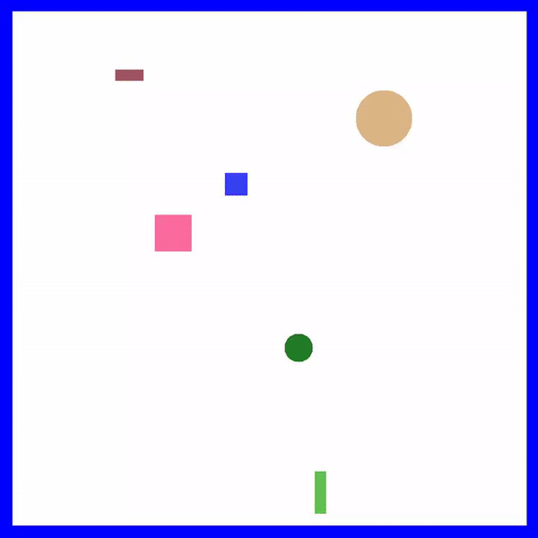

# EAT-Assessment-Project
Engine Architecture and Tools Assessment Project (2D C++ Collision Detection System In Visual Studio Using SDL)

  

## Insights

The goal of this project was to make a standalone 2D collision detetion system that could be easily used in
other projects. You can check out the more information about this system here (Includes documentation):
https://themglegends.itch.io/standalone-collision-detection-system
